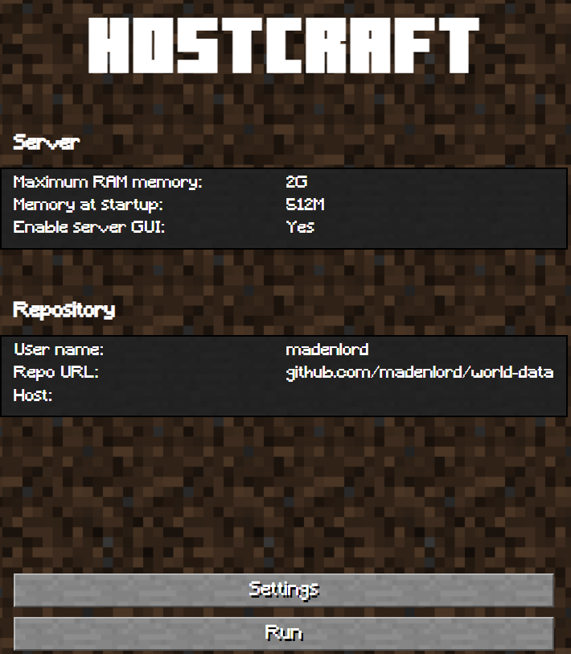

# HostCraft GUI: The Graphical interface of the Host Craft personal project

In my GitHub repo list, a project called MinecraftP2P_Rust can be found. This small CLI belongs to a bigger personal project called HostCraft.
Whilst HostCraft CLI corresponds to the backend of the application, HostCraft GUI is just the front-end, the visual interface to be
applied to the project. 

## About the project

The main goals of this personal project are the following:

1. Challenge myself with three new languages/frameworks (Rust, React-TS and Tauri)
2. Build a desktop application with Tauri to play Minecraft with my friends as we wish, with no central
server whatsoever.

